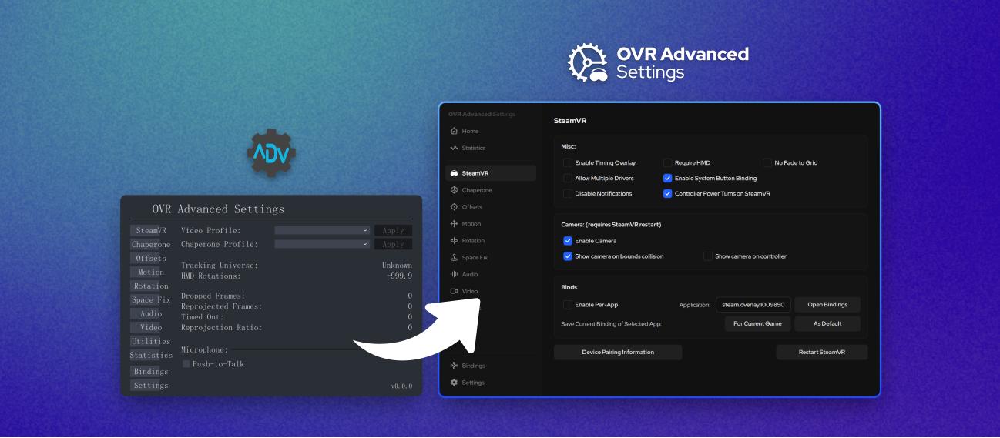

# [OVR Advanced Settings](https://github.com/OpenVR-Advanced-Settings/OpenVR-AdvancedSettings) 现代化 UI

[English](README.md) | 简体中文

使你的 OVR Advanced Settings 的 UI 界面更加现代化。

> [!WARNING]
> 部分功能未经过测试，不能保证全部功能的可用性。

## 使用方法 (Steam 版本)

1. 在 Steam 库中找到 **OVR Advanced Settings**。
2. 点击右侧的 [齿轮] 管理按钮，选择 **[管理] > [浏览本地文件]**。
3. 在打开的文件夹中，右键名为 `res` 的文件夹，选择复制并在此处粘贴，创建一个备份（例如重命名为 `res_bak`）。
4. 在本说明文档所在的文件夹中，进入对应语言的文件夹（如 `English`），将其中的 `res` 文件夹覆盖到 OVR Advanced Settings 的根目录下。如果系统提示冲突，请选择 **[替换目标中的文件]**。

## 使用方法 (GitHub Release 版本)

1. 进入 OVR Advanced Settings 的安装文件夹。
2. 右键名为 `res` 的文件夹，选择复制并在此处粘贴，创建一个备份（例如重命名为 `res_bak`）。
3. 在本说明文档所在的文件夹中，进入对应语言的文件夹（如 `English`），将其中的 `res` 文件夹覆盖到 OVR Advanced Settings 的根目录下。如果系统提示冲突，请选择 **[替换目标中的文件]**。

## 开源协议

本项目基于 **GPLv3** 协议开源。
本项目是 [OVR Advanced Settings](https://github.com/OpenVR-Advanced-Settings/OpenVR-AdvancedSettings) 的衍生作品。
